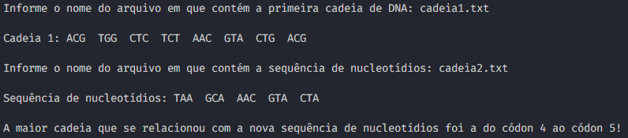
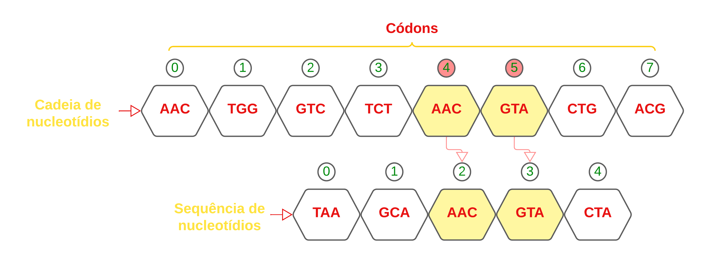

# Exercício de Tipo Abstrato de Dados Lista - Exercício 4

<h1> O problema da máxima cadeia

## Conteúdos

 <a href="#apresentação">Apresentação</a> •
 <a href="#lógica">Lógica</a> • 
 <a href="#representação-gráfica">Representação gráfica</a> • 
 <a href="#compilação-e-execução">Compilação e Execução</a> • 
 <a href="#autor">Autor</a>

---

## Apresentação

Foi proposto pelo professor [Michel Pires da Silva](http://lattes.cnpq.br/1449902596670082) da matéria de `Arquitetura e Estruturas de Dados 1 do 3º Período do curso de Engenharia da Computação` 4 diferentes exercícios relacionados a Tipo Abstrato de Dados Lista, com o objetivo de praticar e adquirir experiencia com esse TAD e seus métodos. O exercício de número 3 foi resolvido utilizando o tipo `Lista Linear` e seus métodos padrões e mais algumas inserções para solucionar o problema proposto no qual tinha o objetivo de identificar e informar a maior cadeia a partir de uma primeira entrada de uma cadeia de nucleotídeos que se relaciona com uma segunda entrada que é uma sequência de nucleotídios, com isso foi feita uma tentativa em que foi obtido êxito para a solução deste problema!

---

## Lógica

Para ser feita a entrada das cadeias e sequências de códons foi utilizada a leitura de arquivos em texto onde era lido uma sequência do exemplo "ACGTGGCTCTCTAACGTACTGACG" e dividida a mesma em tríades com a função criada no programa `SepararEmCodon` onde utiliza a função **substr** da biblioteca _string_ dividindo de 3 em 3 e inserindo na lista.
Após a leitura, é feita a chamada da função `ProcuraRelacao` onde nessa função será feito um tratamento para que encontra uma relação de igualdade entre a cadeia maior e a pequena sequência.

### Como funciona a função ProcuraRelacao:

A função inicia com a declaração de um vector _pos_ onde será armazenada as posições dos códons quando forem iguais para que no final seja imprenso o intervalo em que se obteve a igualdade, onde será imprenso a primeira e ultimo posição desse vector, foi declarada também uma váriavel chamada _verifica_, onde vai fazer a verificação de se já foi encontrada a relação de igualdade e informada, para que não ocorra repetições desnecessárias. A função se resume a dois `FORs` onde o primeiro que é o de **i** vai rodar a cadeia de DNA e o segundo é o de **j** onde irá percorrer a pequena sequência de nucleotídios percorrendo então a pequena sequência inteira comparando-a com o primeiro elemento da cadeia de DNA e depois com o segundo e assim em diante, posterior a esses dois `FORs` será feita uma verificação com um `IF` onde irá verificar se há igualdade as tríades de cada cadeia, buscando a relação entre elas, caso seja encontrado, irá introduzir no `IF` onde será armazenada a posição da primeira relação e irá existir um contador pra verificar se foi a primeira igualdade encotrada, caso seja irá voltar para o for, caso não seja ela irá introduzir em um if onde será verificada se a posição de traz da cadeia maior é igual a posição de traz da cadeia menor para verificar se há uma relação maior entre as cadeias, caso as posições anteriores forem iguais, as posições serão armazenadas no vector para quando for imprensa as posições de relaçãoes mostre a primeira e ultima, sendo este o intervalo de relação entre as cadeias.

---

## Representação gráfica

Segue a representação gráfica de um exemplo de uma verificação de relação entre uma cadeia de nucleotídios fornecida atraves da leitura de um arquivo _cadeia1.txt_ e uma sequência de nucleotídios fornecidas através de um arquivo de texto _cadeia2.txt_ :

                                A maior cadeia que se relacionou com a nova sequência de nucleotídios foi a do códon 4 ao códon 5!

---

## Compilação e Execução

O programa feito de acordo com a proposta possui um arquivo Makefile que realiza todo o procedimento de compilação e execução. Para tanto, temos as seguintes diretrizes de execução:

| Comando                |  Função                                                                                           |                     
| -----------------------| ------------------------------------------------------------------------------------------------- |
|  `make clean`          | Apaga a última compilação realizada contida na pasta build                                        |
|  `make`                | Executa a compilação do programa utilizando o gcc, e o resultado vai para a pasta build           |
|  `make run`            | Executa o programa da pasta build após a realização da compilação             

---

## Autor

Criado por [Pedro Henrique Louback Campos](https://www.linkedin.com/in/pedro-henrique-louback-campos-0a4a03205/)

Aluno do 3° periodo do curso de `Engenharia da Computação` no [CEFET-MG](https://www.cefetmg.br)